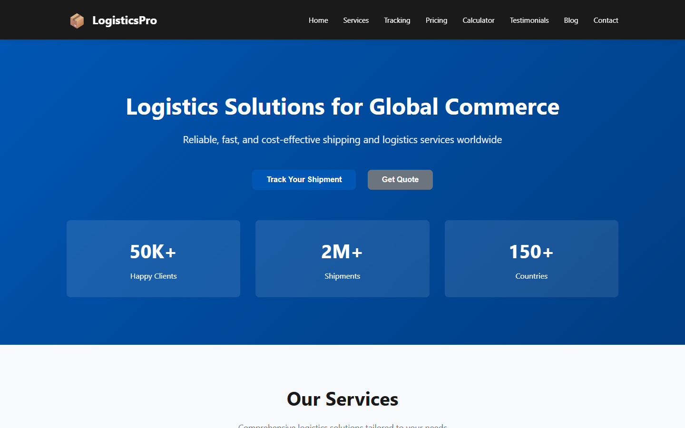
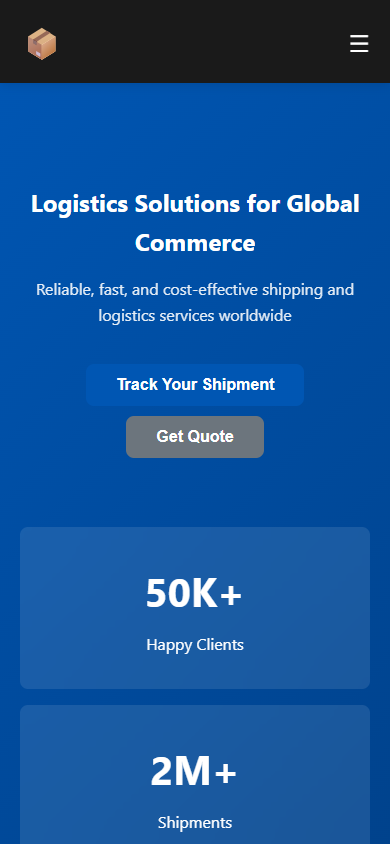

<div align="center">

# LogisticsPro Website


<p>
  
  
  
  
  
</p>

</div>

---

## Project Showcase

**LogisticsPro** is a professional logistics and shipping website demo built with vanilla HTML, CSS, and JavaScript. It includes shipment tracking, a dynamic quote calculator, pricing tiers, services showcase, testimonials, blog preview, and a contact form — fully responsive for mobile, tablet, and desktop.

Built by **Muhammad Afzal Kalwar** as a portfolio-ready static web project for logistics and transport businesses.

## Live Preview

| | |
|---|---|
| **GitHub Pages** | https://mafzalkalwardev.github.io/logistics-pro-website/ |
| **Repository** | [github.com/mafzalkalwardev/logistics-pro-website](https://github.com/mafzalkalwardev/logistics-pro-website) |

## Screenshots

| Homepage | Mobile |
|---|---|
|  |  |

## Key Features

- Sticky navigation with mobile menu toggle
- Hero section with key statistics
- Six logistics service cards
- Interactive shipment tracking timeline
- Three pricing tiers (Starter, Professional, Enterprise)
- Shipping quote calculator (weight, distance, method)
- Team, testimonials, and blog sections
- Contact form with validation
- Smooth scroll and scroll animations

## Tech Stack

- HTML5, CSS3, JavaScript (no framework)
- CSS Grid & Flexbox
- Mobile-first responsive design

## Quick Start

```bash
# Serve locally
npx serve . -p 8080
# Open http://localhost:8080
```

Or open `index.html` directly in a browser.

## Project Structure

```
.
├── index.html
├── css/style.css
├── js/script.js
├── docs/screenshots/
└── README.md
```

---

## About the Developer

**Muhammad Afzal Kalwar** — Full-Stack Developer & Automation Engineer  
GitHub: [@mafzalkalwardev](https://github.com/mafzalkalwardev) · Portfolio: [mafzalkalwardev.github.io](https://mafzalkalwardev.github.io)

<details>
<summary>SEO Keywords</summary>

Muhammad Afzal Kalwar, mafzalkalwardev, logistics website template, shipping tracking UI, quote calculator JavaScript, static website Pakistan developer, transport web design

</details>

---

<div align="center">
  <sub>Built by Muhammad Afzal Kalwar · FT Solutions</sub>
</div>
